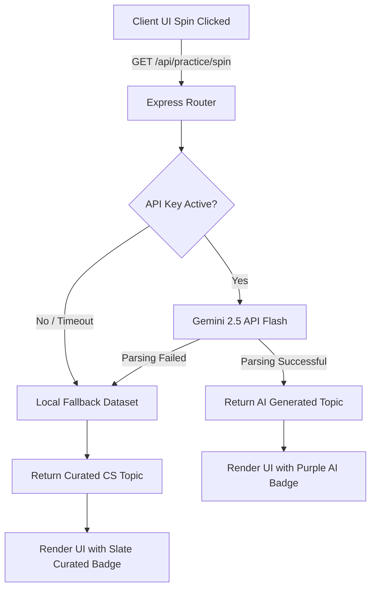

# TechRoulette 🎤✨

> An impromptu speaking and technical communication trainer designed specifically for software engineers.

[](LICENSE)
[](https://nodejs.org)
[](#)

---

## 🚀 Overview & Key Differentiators

For software engineers, entry-level graduates, and competitive programmers, **verbalizing complex topics under pressure** is often the hardest part of the interview loop. **TechRoulette** helps you bridge the gap between technical expertise and clear verbal articulation.

### Key Features
* **Dual Topic Engine**: Dynamic Gemini 2.5 API topic generation + a local 520 curated CS topics fallback database.
* **10-Minute Preparation Countdown**: Formulate bullet points, draft structure, and prepare diagrams.
* **Speech Pitch Timer & Code Editor**: An active presentation canvas with an integrated notepad and incrementing stopwatch.
* **Real-time Audio Engine**: Realistic slot-machine ticking and landing chimes synthesized via the browser's Web Audio API (no external sound assets required).
* **Zero-Loss Session Protection**: Intelligent navigation guards and window refresh warnings to protect active presentations.

---

## 🎨 UI/UX Showcase

### Mastery Dashboard


---

## 🏗️ Architecture & Hybrid Engine Breakdown

TechRoulette employs a low-latency hybrid mechanism. The spin handler tries to query the server-side Gemini generation endpoint, falling back automatically to the local JSON dataset if the server lacks the key or fails.



---

## 📊 Curated CS Domains

TechRoulette supports multiple programming languages (**Java, Python, C++, C, JavaScript**) and covers 7 major computer science pillars:

| Domain | Focus Areas | Typical Topics |
| :--- | :--- | :--- |
| **Computer Networks** | OSI/TCP/IP, UDP, DNS, WebSockets, TLS | HTTP/3 multiplexing, BGP Routing, NAT mechanisms |
| **Operating Systems** | Process management, virtual memory, paging | Deadlock banker's algorithm, Context switching, Mutex |
| **Data Structures** | Memory layouts, hash maps, B-Trees, graphs | Red-Black Trees, Cache Locality, Trie structures |
| **Database Management** | ACID, indexing strategies, normalization | WAL logs, Sharding vs Partitioning, Index layouts |
| **Software Engineering** | STLC/SDLC, OOP principles, testing layers | SOLID principles, CI/CD pipes, TDD trade-offs |
| **System Design** | Load Balancing, CDN caching, microservices | CAP Theorem, Eventual Consistency, rate limiters |
| **Computer Architecture** | CPU pipeline, registers, memory hierarchy | Cache Coherency protocols, Pipelining hazards |

---

## 💻 Local Setup & Environment Variables

### Prerequisites
* Node.js (version 18 or higher)
* NPM (installed with Node)

### Installation
1. Clone the repository:
   ```bash
   git clone https://github.com/yourusername/techroulette.git
   cd techroulette
   ```
2. Install dependencies:
   ```bash
   npm install
   ```
3. Configure environment variables. Create a `.env` file in the project root:
   ```env
   GEMINI_API_KEY=your_gemini_api_key_here
   PORT=3000
   ```
4. Start the application:
   ```bash
   npm start
   ```
5. Open your browser and navigate to `http://localhost:3000`.

---

## 🔊 Audio & Micro-Interaction Details
All sounds in the application are synthesized in real-time using the **Web Audio API** (`OscillatorNode` and `GainNode`).
* **Slot Machine Ticking**: A rapid frequency click sound (`sine` oscillator, rapid decay) to build tension.
* **Landing Chime**: A bright, pleasant two-tone chime synthesized on a success landing.
* **Completion Tone**: An optimistic musical cadence generated upon complete session submit.

---

## 🗺️ Future Roadmap
* **Speech-to-Text Analytics**: Integrate client-side whisper model transcription to analyze speaking pace and filler words (e.g. "uhm", "like").
* **AI Feedback & Evaluation**: Real-time evaluation of the speaker's key research points based on the transcript.
* **Peer Reviews**: Live speaking rooms to present to peers and get structured feedback.

---

## 📄 License
Distributed under the MIT License. See `LICENSE` for more information.
